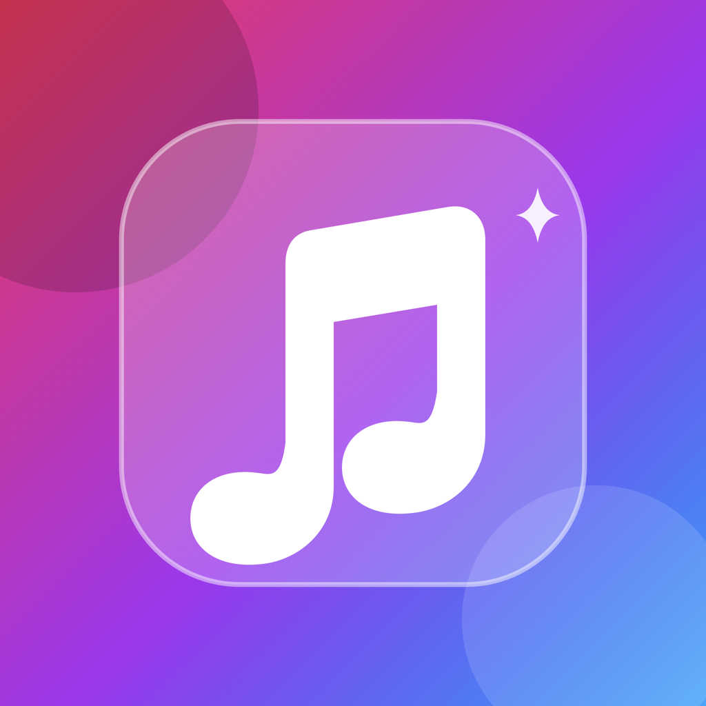

<p align="center">
  
</p>

<h1 align="center">MusicGlass</h1>

<p align="center">
  [🇬🇧 English](README.md) | <strong>🇫🇷 Français</strong>
</p>

<p align="center">
  <strong>Un lecteur de musique iOS natif haut de gamme, doté d'une superbe interface "Liquid Glass" et propulsé par la découverte de YouTube Music.</strong>
</p>

<p align="center">
  <a href="#fonctionnalités">Fonctionnalités</a> •
  <a href="#architecture">Architecture</a> •
  <a href="#installation">Installation</a> •
  <a href="#roadmap">Roadmap</a>
</p>

---

## ✨ Aperçu

**MusicGlass** est un lecteur de musique iOS moderne et haute-fidélité, conçu avec une interface SwiftUI méticuleusement soignée. Il fait le pont entre une esthétique native premium (inspirée des matériaux "Liquid Glass" d'Apple Music) et le vaste catalogue de YouTube Music via un client InnerTube personnalisé et robuste.

Entièrement développé en **SwiftUI** et propulsé par **SwiftData** et **AVPlayer**, MusicGlass offre une expérience d'écoute fluide, rapide et magnifique sans faire de compromis sur les performances.

> **Avertissement :** Ceci est un prototype tiers. Il n'est ni affilié, ni approuvé, ni associé à YouTube, Google, Apple ou leurs affiliés. Il n'inclut aucun contournement de DRM.

## 🚀 Fonctionnalités clés

### 🎨 Superbe Interface "Liquid Glass"
- Rendu matériel sur-mesure qui reproduit parfaitement les flous natifs d'iOS.
- Micro-animations et transitions réactives et fluides.
- Un écran de lecture, un mini-lecteur et une file d'attente interactive entièrement responsifs.

### 🎧 Lecture sans compromis
- **Moteur natif `AVPlayer`** : Profitez directement de flux audio de haute qualité.
- **Intégration système** : Prise en charge complète de l'audio en arrière-plan, des métadonnées sur l'écran de verrouillage et des commandes du Centre de contrôle.
- **Gestion intelligente de la file d'attente** : Intègre les modes aléatoire, répétition et des transitions fluides entre les pistes.

### 🔍 Découverte & Bibliothèque (InnerTube)
- **Flux d'accueil** : Flux personnalisé exploitant YouTube Music (`FEmusic_home`), fusionné avec votre historique local.
- **Recherche ultra-rapide** : Recherche avec un debounce de 350 ms et des résultats regroupés (Chansons, Albums, Artistes, Playlists, Vidéos).
- **Métadonnées orientées hors-ligne** : Persistance locale de vos Favoris et de votre Historique grâce à **SwiftData**.

### 🎤 Paroles immersives
- Intégration native avec **LRCLib** pour la recherche en temps réel de paroles simples ou synchronisées.

---

## 🛠️ Avancées Technologiques

MusicGlass n'est pas qu'un simple wrapper musical. Il repose sur une architecture moderne et robuste :

- **100% SwiftUI** : Entièrement conçu à l'aide des derniers paradigmes d'interface utilisateur déclarative.
- **SwiftData** : Base de données locale moderne et rapide pour la persistance utilisateur.
- **Logger réseau sur-mesure** : Logger réseau masquant les données sensibles pour surveiller les appels API en toute sécurité.
- **Mapping JSON défensif** : Client InnerTube très permissif pour gérer gracieusement les changements de structure de l'API YouTube Music.
- **Architecture découplée** : Séparation propre entre les couches `App`, `Core`, `Networking`, `YouTubeMusic`, `Playback`, `Persistence` et `UI`.

## 📦 Installation & Configuration

1. Clonez le dépôt et ouvrez `MusicGlass.xcodeproj` dans **Xcode 26.4** ou une version plus récente.
2. Sélectionnez le schéma `MusicGlass`.
3. Compilez et lancez sur un appareil ou simulateur sous **iOS 26+** pour profiter de l'expérience Liquid Glass complète. *(iOS 17/18 propose une alternative matérielle par défaut)*.

### Vérification de build en CLI

```bash
xcodebuild -project MusicGlass.xcodeproj -target MusicGlass -configuration Debug -sdk iphonesimulator CODE_SIGNING_ALLOWED=NO build
xcodebuild -project MusicGlass.xcodeproj -target MusicGlassTests -configuration Debug -sdk iphonesimulator CODE_SIGNING_ALLOWED=NO build
```

*Note : L'application nécessite un accès réseau pour la découverte et la lecture. L'audio en arrière-plan est activé via `UIBackgroundModes`.*

## 🛣️ Roadmap (Feuille de route)

- [ ] **Authentification** : Connexion sécurisée à YouTube Music via le Keychain.
- [ ] **Synchronisation de la bibliothèque** : Synchronisation distante des chansons, albums, artistes et playlists.
- [ ] **Paroles avancées** : Surlignage synchronisé des paroles façon karaoké.
- [ ] **Mode hors-ligne intelligent** : Mise en cache pour la lecture sans connexion.
- [ ] **Écosystème** : Widgets, Activités en direct (Live Activities) et intégration potentielle de CarPlay/ShazamKit.
- [ ] **Social** : Scrobbling Last.fm et sessions d'écoute à plusieurs.

## 🤝 Contribution

Les contributions, signalements de bugs et demandes de fonctionnalités sont les bienvenus ! N'hésitez pas à consulter la [page des issues](https://github.com/jeremy99981/MusicGlass/issues).

---

<p align="center">
  <i>Conçu avec ❤️ pour les passionnés de musique et les développeurs Swift.</i>
</p>
